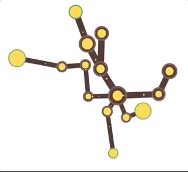

# Tree Simulator

Totally experimental project on resource management. Inspired by the Simcity 5 resource management.

The aim is to create a (not very realistic) node based simulation of a tree, with a focus on the resource transfer and management. It should grow and die based on the available resources.

Coded in vanilla HTML 5 and Javascript with a custom canvas application.

## Screencap (v1)

Basic resource transfer complete. No growth or death of nodes yet.
