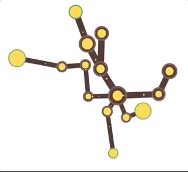

# Tree Simulator

Totally experimental project on resource management. Inspired by the Simcity 5 resource management, networking, and game of life.

The aim is to create a (not very realistic) node based simulation of a tree, with a focus on the resource transfer and management. The nodes will should grow and die based on the resources available.

The hope is that emergent behaviour will appear and the organism as a whole will (learn to?) survive even though each node follows a set of it's own rules.

Coded in vanilla HTML 5 and Javascript with a custom canvas application.

## Screencap (v1)

Basic resource transfer complete. No growth or death of nodes yet.

## v2
Nodes spawn and die.
Nodes move.
Nodes transfer two types of resources now.
Branches and movement is based on the size of the connected nodes.
Many graphical aspects are animated.

## v3 (todo)
Resource packets will no longer be sent at regular intervals.
Resource packets will hold the original sender.
Nodes will keep a ledger of where each other packet came from.
Nodes will send out a help signal when running low on resources.
Nodes that can help can then send packets that are directed to the node that needs help 